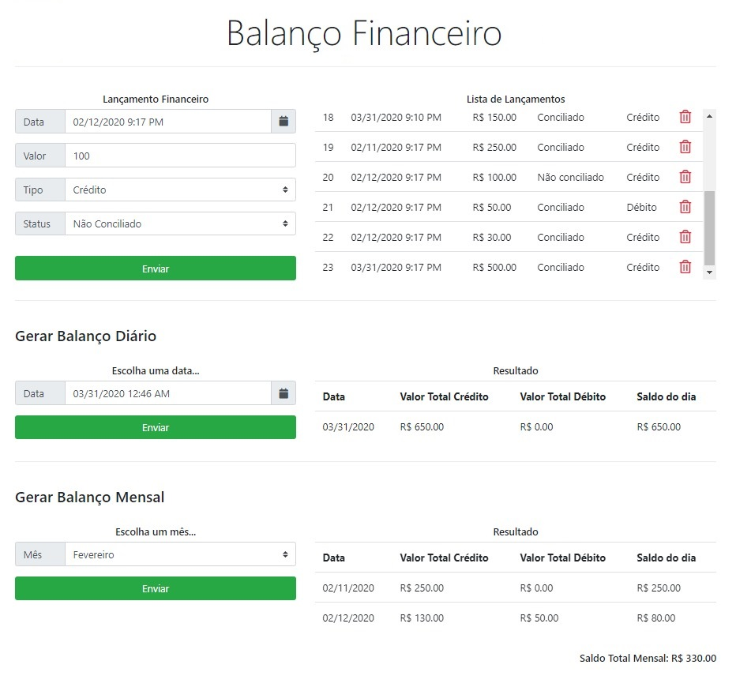

# Balanço Financeiro
### Tecnologias utilizadas
- Angular 9 [Frontend]
- C# - ASP NET Core [Backend]
- MS SQL Server (Local) [DB]
- Swagger [Documentação API]

### Features
  - Cadastro de Lançamentos Financeiros
  - Edição de Lançamentos Financeiros
  - Deleção de Lançamentos Financeiros
  - Consultar lista de todos os Lançamentos Financeiros
  - Gerar balanço diário
  - Gerar balanço mensal

### Regras
- Caso o lançamento já tenha sido conciliado não deve permitir edição nem deleção do registro;
- O balanço do dia deve contemplar todos os lançamentos de crédito e débito diário com o cálculo de saldo; (CRÉDITO - DÉBITO)
- O relatório mensal de balanço deve demonstrar para cada dia do mês qual foi o total de crédito e débito bem como o saldo em sua totalização mensal;

### Frontend preview

### Swagger

License
----
MIT